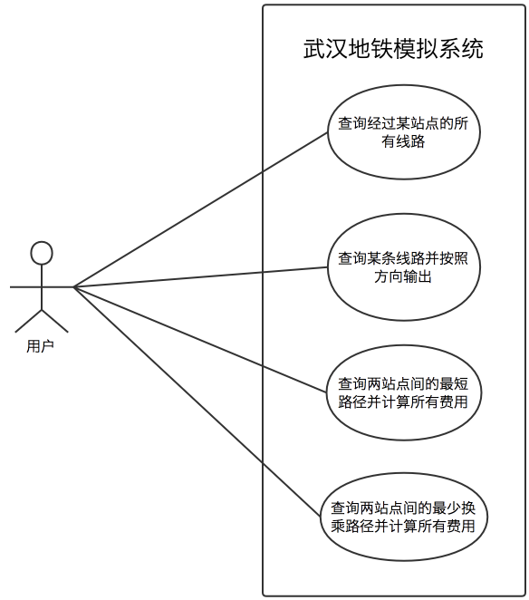
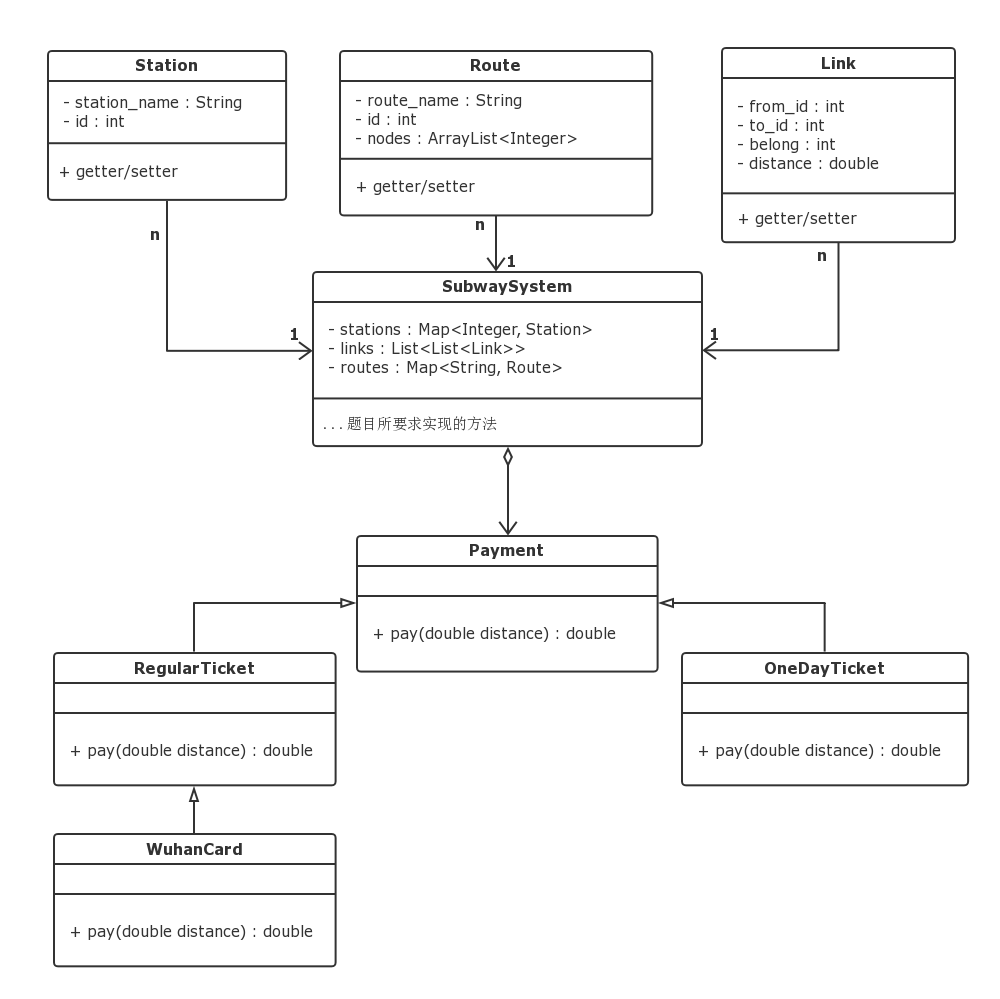

<h1>武汉地铁模拟系统</h1>

<b>学号</b>：

<b>班级</b>：软工1703

<b>姓名</b>：杨家玺

<h2>一、用例图</h2>

 

武汉地铁模拟系统的用例“查询两站点间的最少换乘路径并计算所有费用”的描述如下：

- 简要说明：系统根据用户输入的起点站与终点站，输出其间的最少换乘路径与各种付款方式所需的费用
- 主事件流：
  - 用户在图形界面上选择“最少换乘”功能
  - 用户输入起点站与终点站
  - 系统根据用户输入的信息查询其间的最少换乘路径
  - 系统计算路径的总长度，据此计算三种付费方式所需支付的费用
  - 系统将所有结果输出到图形界面的文本框中
  - 事件结束
- 其他事件流：
  - 如果输入的起点站与终点站信息错误，或找不到一条可行的路线，系统在图形界面的文本框中给出错误提示
- 前提条件：
  - 用户选择了“最少换乘”功能
  - 用户输入了起点站与终点站
  - 用户按下了“查询按钮”
- 事后条件：
  - 图形界面的文本框里
    - 若系统查询到可行路线，输出换乘信息、总站数、总里程数、各种支付方式所需费用
    - 若系统未查询到可行路线，或用户错误输入，输出错误提示
  - 输入文本框“起点站”与“终点站”清空

<h2>二、系统类图</h2>

