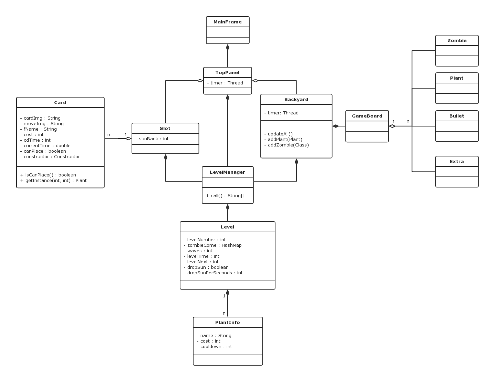
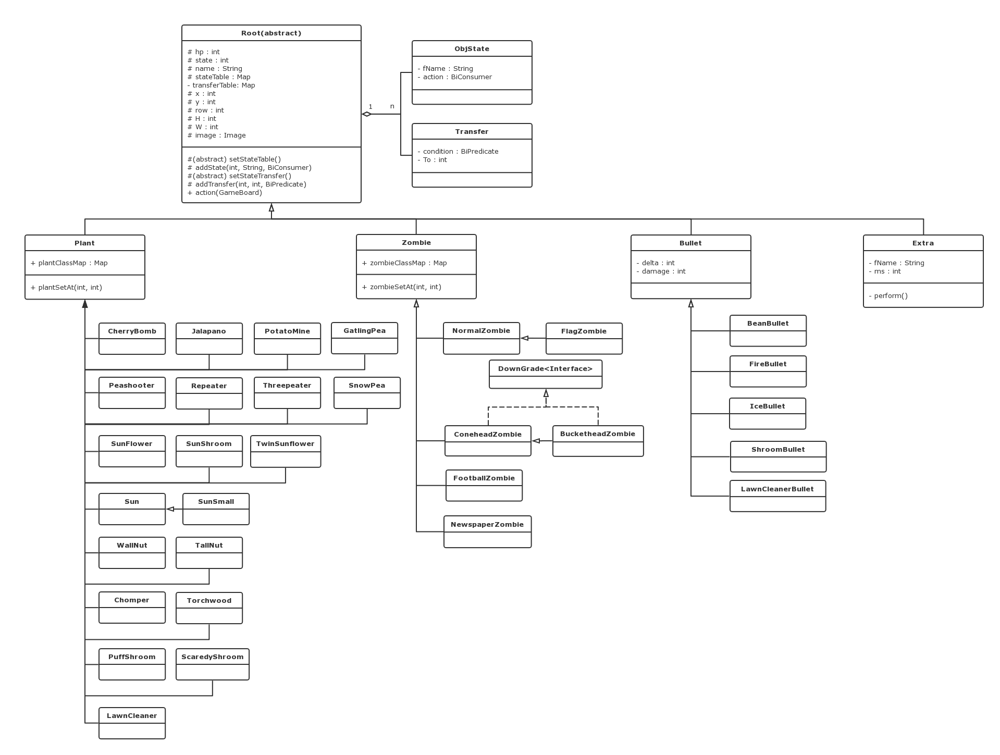
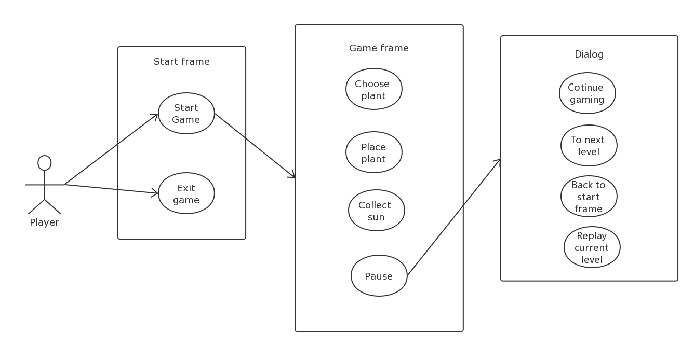
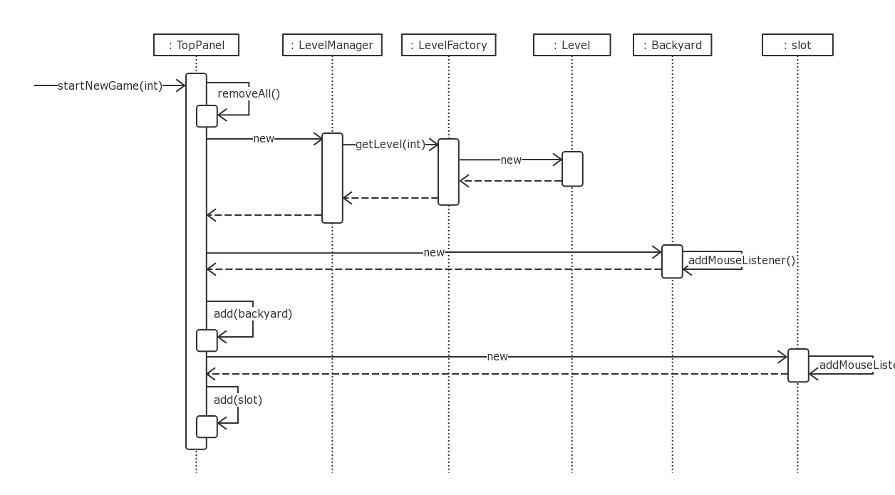
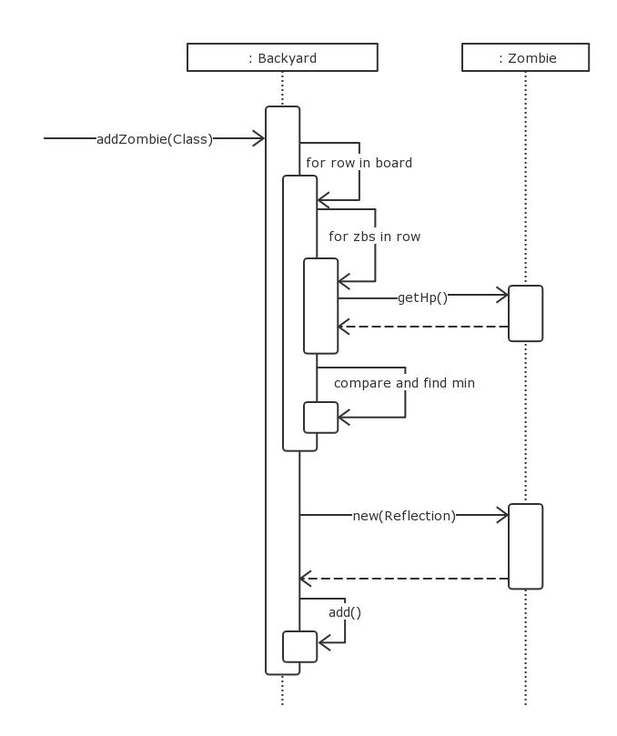
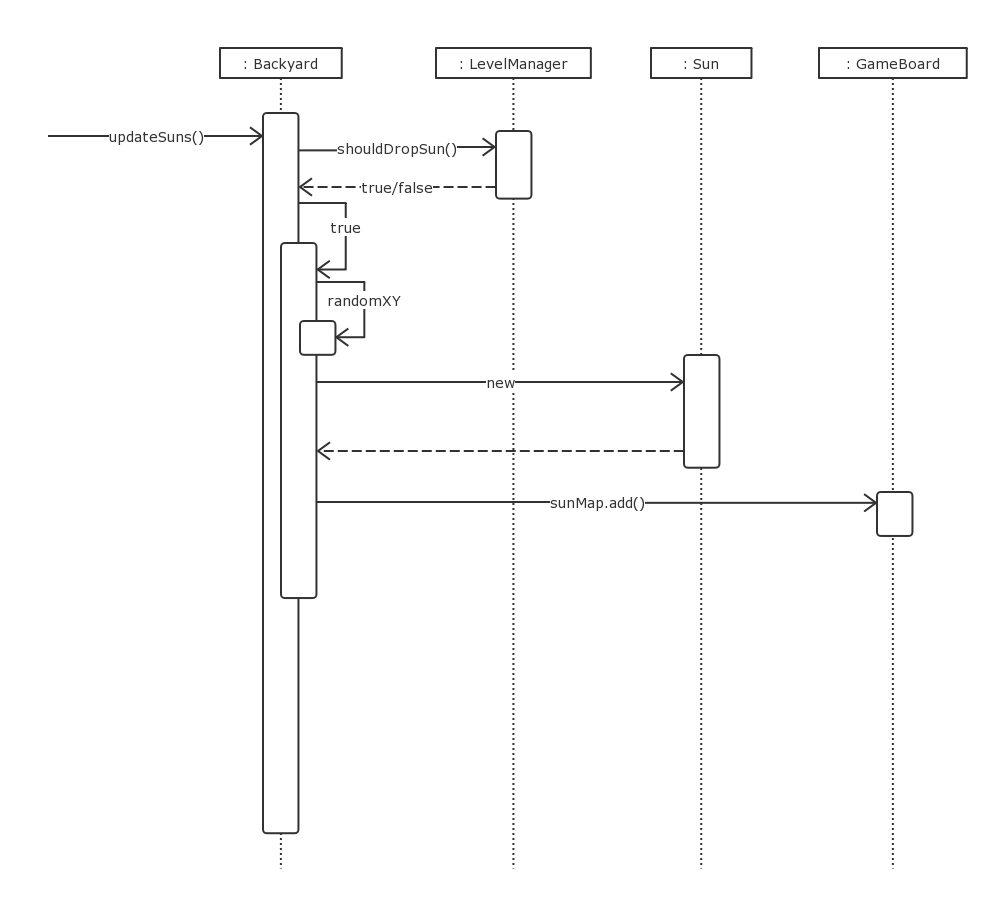
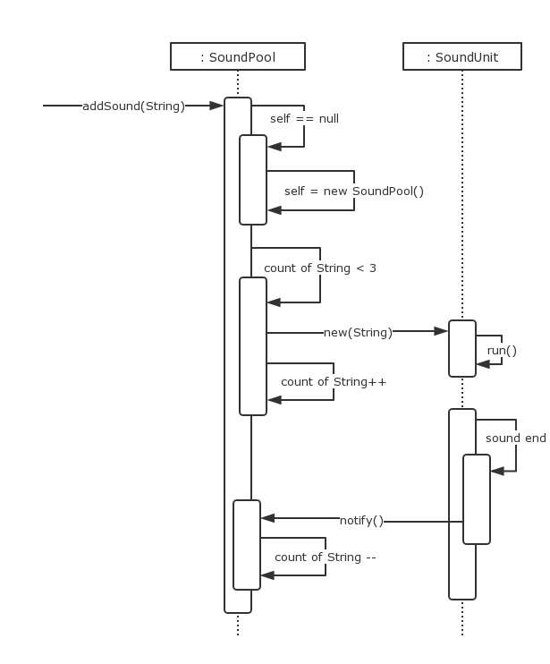

# OOP课程设计

2018.11.30

## 〇、团队信息

- 组号：14
- 队长：张兆琛
- 队员：罗傲杰、刘俞兰、吴静然、杨家玺
- 班级：软工1703

## 一、植物大战僵尸游戏规则

### 游戏简介

玩家通过种植太阳花收取阳光来购买植物；通过种植不同的植物来抵御僵尸的攻击。当一个关卡里的僵尸全部被消灭时，玩家胜；当僵尸越过地图的右边界时，僵尸胜利。

### 植物简介

购买植物需要花费一定数量的阳光，每购买一次过后需要冷却一段时间才能再次购买。每个关卡允许使用的植物各有不同，不同植物的特性也不同

植物主要分为：攻击类，防御类和生产类。也可以分为夜间植物和白天植物（夜间植物只能在夜间出现）

#### 攻击类

- 发射类
- 防御类
- 攻击增强类

#### 发射类

当僵尸进入射手的射程内时，射手会发射豌豆攻击。

- 豌豆射手

  - 单发射手
    - 攻击：20
    - 耐久：300
    - 射程：正前方一整行
  - 双发射手
    - 发射速度是单发射手的两倍，其余同单发射手。
  - 三线射手
    - 该植物可同时向3排（植物所处排和左右排）同时发射出3颗豌豆 ，其余同单发射手。
  - 寒冰射手
    - 寒冰射手每次攻击发射一颗冰豌豆,命中目标后对僵尸造成伤害。其余同单发射手。
  - 机枪射手
    - 连续射出四发豌豆子弹
    - 四倍的快乐
  - 小喷菇（夜间植物）
    - 小喷菇免费
    - 射程短
  - 胆小菇（夜间植物）
    - 它是一种远程射手，敌人接近后会躲起来，不会攻击。
    - 攻击：20
    - 耐久：300
    - 射程：正前方一整行

#### 爆炸类

- 樱桃炸弹
  - 种下0.6秒后爆炸，能炸死3*3范围内的僵尸
- 火爆辣椒
  - 种下0.75秒后爆炸，能炸死同排的僵尸
- 土豆雷
  - 种下后2s后长大，在此期间可以被僵尸吃掉。
  - 长大后进入等待状态，当同排僵尸距离土豆雷半格时，土豆雷爆炸，僵尸被炸死。
  - 耐久： 300

#### 吞食类

- 食人花
  - 能够一口吞掉僵尸，然后要咀嚼消化一段时间，此时容易受到攻击。
  - 耐久：300

#### 攻击增强类

- 火炬树桩
  - 用来增强豌豆植物发射的豌豆的火力，当豌豆划过树桩后，会变成火球，豌豆的威力变成2倍
  - 但是如果穿过的是寒冰豌豆就会变成普通的豌豆了

#### 防御类

- 坚果墙
  - 攻击性：0（无攻击力）
  - 防御力：3000（较高）
  - 用于阻碍僵尸前进的步伐
- 高坚果
  - 巨大的坚果，可以更好的阻挡僵尸前行
  - 攻击性：0（无攻击力）
  - 防御力：8000

#### 生产类

生产阳光，供拾取购买植物

- 向日葵
  - 可生产阳光
  - 耐久：300
- 阳光菇（夜间植物）
  - 白天睡觉，可在夜间生产阳光
  - 耐久：250
- 双子向日葵
  - 双份的阳光，双份的喜悦
  - 耐久：300

#### 僵尸简介

在游戏中，不同种类的僵尸会一波波的攻击。不同僵尸的攻击值，耐久，特性有所不同。

僵尸分为：

- 普通僵尸
  - 游戏中最普通的花园僵尸
  - 血量：270（普通）
  - 攻击：啃食攻击，100/秒
  - 速度：约4.7秒/格（普通）
- 旗帜僵尸
  - 该僵尸是领头者，速度比普通僵尸快
  - 血量：270
- 路障僵尸
  - 防御能力是普通僵尸的两倍
  - 血量：640
- 铁桶僵尸
  - 防御能力比路障僵尸更强
  - 血量：1100
- 橄榄球僵尸
  - 速度很快，防御强于铁桶僵尸
  - 血量：1160
- 读报僵尸
  - 报纸可做防御，拿着报纸时速度很慢
  - 多次受到攻击后失去报纸，防御变低，速度变快
  - 血量：420

#### 附加道具简介

- 小推车
  - 位于最后防线的前方，当僵尸濒临最后防线时，小推车出动，将同排僵尸碾压致死。
- 阳光
  - 可以靠天吃饭获得
  - 可以生产类植物处获得
  - 拾取后，可用来购买植物

#### 关卡简介

逐个关卡击破，取得最终胜利。

关卡很有趣，请各位自行体验，这里不再赘述。

## 二、文档

### 1. 类图

整体：



核心部分：



大图见docs文件夹

## 2. 用例图



### 3. 时序图

I. 更新植物


II. 开始新游戏



III. 向僵尸总HP最少的行添加一个指定的僵尸



IV. 阳光下落



V. 向音频池添加游戏音效



## 三、项目完成情况

这是一份项目开始时准备的的TODO-List

```markdown
游戏核心
    - [x] 单次派发系统
        - [x] 基于FSM的状态机制
        - [x] 基于多线程的音频池(使用.wav)
        - [x] 附带(类似)回调函数的杂项GIF播放系统
    - [x] 交互界面
        - [x] 开始界面
        - [x] 游戏界面
            - [x] 后院
            - [x] 卡牌槽
                - [x] 阳光槽
                - [x] 卡牌槽
                - [x] 卡牌
                - [x] 关卡进度
            - [x] 界面交互
                - [x] 放置植物
                - [x] 收集阳光
            - [x] 暂停界面
            - [x] 通关/失败提示
    - [x] 关卡设计
        - 考虑一关总僵尸量一定
        - 每间隔一段时间放置
        - 原则：
            - 在僵尸总HP最少的行上放置
植物
    - [x] 普通植物
        - [x] 向日葵
        - [x] 双子向日葵
        - [x] 豌豆射手
        - [x] 双发射手
        - [x] 三线射手
        - [x] 机枪射手
        - [x] 寒冰射手
        - [x] 坚果墙
        - [x] 高坚果
        - [x] 食人花
        - [x] 樱桃炸弹
        - [x] 火爆辣椒
        - [x] 土豆雷
        - [x] 火炬树桩
    - [ ] 夜间植物
        - [x] 小喷菇
        - [x] 胆小菇
        - [ ] 大喷菇
        - [x] 阳光菇  
僵尸
    - [x] 普通僵尸
    - [x] 旗帜僵尸
    - [x] 路障僵尸
    - [x] 铁桶僵尸
    - [x] 橄榄球僵尸
    - [ ] 小丑僵尸
    - [x] 读报僵尸
    - [ ] 撑杆跳僵尸
子弹类
    - [x] 豌豆
    - [x] 冰豌豆
    - [x] 燃烧豌豆
    - [x] 孢子
    - [ ] 大孢子(大喷菇)
```

## 四、成员分工

### 杨家玺

- 游戏框架设计，提出了基于FSM的AI系统
- 完成了豌豆射手、坚果墙、普通僵尸与路障僵尸
- 设计音频池系统
- 设计界面

### 刘俞兰

- 实现旗帜僵尸、橄榄球僵尸、报纸僵尸
- 实现高坚果、小喷菇、寒冰射手
- 实现冰子弹与孢子子弹

### 吴静然

- 实现双发射手、三线射手、樱桃炸弹、土豆雷
- 负责游戏规则文档编写
- 设计游戏关卡

### 张兆琛

- 成功解决GIF播放时的黑框问题
- 负责所有GIF的二次处理
- 实现胆小菇、双子向日葵、机枪射手
- 实现最后一行的推车

### 罗傲杰

- 实现火炬树桩、火爆辣椒、阳光菇
- 实现铁桶僵尸
- 实现燃烧子弹
- 添加游戏音效
- 负责画用例图

## 五、附录

## (魔幻)植物大战(成精)僵尸扩展编程不Van全指南

## 原理简介

一、名词解释

1. FSM，有限状态自动机，一个FSM相当于一个独立的AI系统，每一个能够独立动作个体都拥有属于自己的FSM系统。举几个例子
    - 豌豆射手拥有以下几种状态
        - 0：待机态，没有可以攻击的僵尸
        - 1：攻击态，攻击态=攻击+CD
        - 2：HP耗尽，立即被回收
    - 普通僵尸拥有以下几种状态
        - 0 : 待机态，未出场
        - 1 : 有头行走
        - 2 : 有头攻击
        - 3 : 无头行走
        - 4 : 无头攻击
        - 5 : 被炸死，立即被回收
        - 6 : 无头死亡(正常死亡)，立即被回收
    - 一个状态又两部分组成，一是表示状态的数字，这个数字是这个状态的唯一标示，二是状态附带的动作，即个体被判定处于这个状态后应该执行的操作。例子接上面
        - 对于豌豆射手
            - 0/1:
                - 当HP耗尽 -> 2
            - 0:
                - 当观测到有可攻击的僵尸 -> 1
            - 1:
                - 当不再有可攻击的僵尸(上面的检测条件添加`.negate()`即可实现) -> 0
        - 对于普通僵尸
            - 1/2/3/4:
                - 当受到足以致命的爆炸伤害 -> 5
            - 3/4:
                - 当HP耗尽 -> 6
            - 1:
                - 观测到可攻击 -> 2
                - HP低于阈值 -> 3(掉头行走)
            - 2:
                - 不再可攻击(等价于(1->2)`.negate()`) -> 1
                - HP低于阈值 -> 4(掉头攻击)
            - 3:
                - 观测到可攻击 -> 4
            - 4:
                - 不再可攻击(等价于(3->4)`.negate()`) -> 3
        - ***要求:***
            - 任何对于死亡的检测必须写在前面，因为没有实现状态转移的优先级，当检测到可满足的转移条件后就不再检测其他条件
2. 函数式编程，本项目使用函数编程接口
    - `Predicate`:
        - 接受参数并返回`true/false`
        - 用作检测是否满足转移条件
        - 程序中使用`BiPredicate`，接受两个参数，一是游戏棋盘的总体，二是实体本身
    - `Consumer`
        - 接受参数并执行，无返回值
        - 用作状态的执行
        - 程序中使用`BiConsumer`，接受两个参数，同上
3. 音频池，用来播放游戏中的音乐与音效
    - 背景音乐，同一时刻只允许存在一个背景音乐，且背景音乐自动设置为循环播放
    - 游戏音效，子弹击中僵尸、僵尸啃噬植物等均为音效，一经添加立即播放，播放完毕后释放资源(由JVM接管)

二、代码组织形式

1. 库组织形式
    - `model` 模型
        - `base`基本类型
        - `bullets`子弹
        - `plants`植物
        - `sound`音频
        - `zombies`僵尸
        - `level` 关卡
    - `view`  视图渲染部分
    - `controller`    用户交互界面
2. 游戏棋盘`GameBoard`成分
    - 僵尸图 `zombieMap`
    - 植物图 `plantMap`
    - 子弹图 `bulletMap`
    - 杂项图 `extraMap`
    - 阳光图 `sumMap`，原本设计在杂项里，但考虑到检测的效率，故独立之

## 核心API讲解

0. 注意，本部分代码因项目后期没有维护，可能已过时，详情请参考具体代码

1. `abstract void setStateTable(); //设置状态表`
    - 任何继承`Root`的子类都必须实现的方法
    - 以豌豆射手`Pershooter`类为例：
        ```Java
        protected void setStateTable()
        {
            // 0 : 正常
            // 1 : 攻击
            // 2 : HP耗尽
            BiConsumer<GameBoard, Root> attack = ((gameBoard, root) ->
            // 攻击时应该做什么
            {
                if ((intervalCount++) % attackPerTicks == 0)
                {
                    Plant pt = (Plant) root;
                    for (Object ob : gameBoard.zombieMap.getRow(pt.getY()))
                    {
                        Zombie zb = (Zombie) ob;
                        if (zb.getX() - pt.getX() <= MAX_PROBE_RANGE)
                        {
                            gameBoard.bulletMap.getRow(pt.getY()).add(
                                new BeanBullet(pt.getX() + pt.getWidth() / 2, pt.getY()));
                            SoundPool.addSound(GameRule.choice(GameRule.pea_shoot));
                            return;
                        }
                    }
                }
            });
            addState(0, "peashooter.gif", null);
            addState(1, "peashooter.gif", attack);
            addState(2, "peashooter.gif", (gameBoard, root) -> finish = true);
        }
        ```
    - 类中的方法`addState`
        - 接受两个参数
        - 方法签名为`void addState(int state, String fName, BiConsumer<GameBoard, Root> action)`
            - `state`为当前状态码
            - `fName`为状态要播放的gif，可为`null`
            - `action`为`BiConsumer`，是该状态要执行的操作，可为`null`

2. `abstract void setStateTransfer(); //设置转移条件`
    - 任何继承`Root`的子类都必须实现的方法
    - 以豌豆射手`Pershooter`类为例：
        ```Java
        protected void setStateTransfer()
        {
            // BOTH -> HP耗尽死亡
            addTransfer(new int[] {0, 1}, 2, ((gameBoard, root) -> hp <= 0));
            // 待机 -> 开始攻击
            addTransfer(0, 1, getAttackTransfer(MAX_PROBE_RANGE));
            // 攻击 -> 待机
            addTransfer(1, 0, getAttackTransfer(MAX_PROBE_RANGE).negate());
        }
        ```
    - 类中的方法`addTransfer`
        - 接受三个参数
        - 方法签名为`void addTransfer(int from, int to, BiPredicate<GameBoard, Root> cond)`
            - `from`为来自的状态
            - `to`为满足`cond`后转移到的状态
            - `cond`为`BiPredicate`，是状态转移条件
            - 还定义有方法`void addTransfer(int[] froms, int to, BiPredicate<GameBoard, Root> cond)`
                - `froms`数组中各元素都会被展开成原方法形式
                - 旨在实现快速添加对象死亡的转移条件

3. 音频池`SoundPool`系统
    - 音频池为游戏提供了背景音乐与游戏音效支持
    - `public static void addSound(String fName)`
        - **添加音效**
        - 音效会被立刻播放
        - 播放结束后自动回收
        - 一时刻可能有很多很多音效在播放
    - `public static void setBGmusic(String fName)`
        - **设置背景音乐**
        - 音乐会被立刻播放
        - 音乐循环
        - 每一时刻只能有一首正在播放的BGM，重设后会替换原BGM
    - **注意**
        - 上述两方法为静态方法，调用方式为
            - `SoundPool.addSound(xxxxx);`
            - `SoundPool.setBGmusic(xxxxx);`
        - 编码人员不用创建该类的任何实例，两静态方法会自动处理
    - 现状：音频系统是引起游戏很卡的罪魁祸首
        - [完成]初步优化：使用字典管理正在播放的音频，限制同一音频最多同时播放3个，稍有改善

        - [待进行]进一步构思：
            - 使用线程池技术，预先开辟线程，消除线程构造与回收造成的系统资源消耗

4. 关卡`Level & LevelManager & LevelFactory`系统
    - `Level`: 保存一个关卡的信息
    - `LevelManager`: 组合一个`Level`并被多个类所传递，用于获取关卡信息与处理游戏胜负
    - `LevelFactory`: 关卡工厂，想添加新的关卡就写在这里
    - 如何写一个新关卡:
        - 你需要提供
            - 关卡的编号
            - 出现在本关的所有僵尸与他们的数量
            - 总波数
            - 总时间
            - 下一关的编号(-1代表结束)
            - 可以使用的植物
            - 场景图片
            - 背景音乐
            - 是否从天上掉落阳光
            - 掉落阳光的间隔是多少
            - 预先设置的植物
        - 编写成代码:
            ```Java
            Level level = new Level();
            HashMap<String, Integer> zombieCount = new HashMap<>();
            ArrayList<PlantInfo> cards = new ArrayList<>();
            ArrayList<PreSetPlant> pres = new ArrayList<>();
            zombieCount.put("normal_zombie", 10);              // 10个普通僵尸
            zombieCount.put("football_zombie", 10);            // 10个橄榄球僵尸
            zombieCount.put("buckethead_zombie", 5);           // 5个铁桶僵尸
            zombieCount.put("conehead_zombie", 5);             // 5个路障僵尸
            zombieCount.put("newspaper_zombie", 5);            // 5个读报僵尸

            cards.add(new PlantInfo("Chomper", 50, 2));
            // 可使用食人花, 花费50阳光，冷却2s
            cards.add(new PlantInfo("Jalapeno", 50, 2));       // 火爆辣椒
            cards.add(new PlantInfo("Peashooter", 100, 2));    // 豌豆射手
            cards.add(new PlantInfo("Threepeater", 100, 2));   // 三发射手
            cards.add(new PlantInfo("CherryBomb", 100, 2));    // 樱桃炸弹
            cards.add(new PlantInfo("ScaredyShroom", 100, 2)); // 胆小菇

            // 预设植物, new (name, col, row)
            pres.add(new PreSetPlant("PotatoMine", 5, 0));
            pres.add(new PreSetPlant("PotatoMine", 5, 1));
            pres.add(new PreSetPlant("PotatoMine", 5, 2));
            pres.add(new PreSetPlant("PotatoMine", 5, 3));
            pres.add(new PreSetPlant("PotatoMine", 5, 4));

            level.setLevelNumber(1)                   // 关卡编号1
                 .setZombies(zombieCount)             // 设置所有僵尸(见上方)
                 .setWaves(10)                        // 10波
                 .setLevelTime(50)                    // 50秒(最后一波僵尸出现的时间)
                 .setLevelNext(2)                     // 下一关进入编号2
                 .setPlantInfos(cards)                // 设置可使用的植物
                 .setlevelImg(GameRule.backgroundDay) // 关卡背景
                 .setLevelBgmusic(GameRule.dayBG)     // 背景音乐
                 .setDropSun(true)                    // 白天，从天上掉阳光
                 .setDropSunPerSeconds(5)             // 第一关，阳光掉落频繁
                 .setPrePlants(pres);                 // 预设植物，可为空
            ```
        - 由于大量使用了Java的**反射**机制，使得程序具有特别强大的灵活性，可以看出，仅需要一个字符串便能调用一个类
        - 所以，新建一个关卡只需要填写很少的代码
        - 由于植物的花费与冷却时间可控，我们还可以做出许多有趣的小游戏，比如:
            - 一关只允许使用爆炸物，且爆炸物冷却时间极短而且花费很低
            - 一关的高坚果与坚果墙十分廉价，但攻击方式只有普通豌豆射手
            - 更多脑洞任君开发

5. 僵尸、植物、子弹或杂项何时被系统删除
    - 在`Root`类中有一名为`finish`的布尔型变量，一旦为`true`，则会在最近一次的更新中被移除
    - 对于动画，例如僵尸的倒下死亡或被炸死，有两种处理思路
        - 转移到这个状态，播放这个gif，`sleep`对应时间后在设置为`finish=true`
        - 转移到这个状态，立刻设置为`finish=true`，在杂项`map`内添加这样的gif
    - 本程序在简洁性与易扩展型的考量下决定使用后者，具体使用方法举例如下：
        ```Java
        // 僵尸被炸死
        addState(5, null, (gameBoard, root) ->
        {
            finish = true;
            gameBoard.extraMap.add(new Extra(getPath() + "boom_die.gif", 3500, getX(), getY()));
        });

        // 僵尸HP耗尽
        addState(6, null, (gameBoard, root) ->
        {
            finish = true;
            gameBoard.extraMap.add(new Extra(getPath() + "nohead_die.gif", 1500, getX(), getY()));
        });
        ```
    - `Extra`类的构造函数签名如下
        - `public Extra(String fName, int ms, int x, int y, boolean bullet)`
        - 与`public Extra(String fName, int ms, int x, int y)`
        - 其中
            - `fName`为需要播放的gif文件
            - `ms`为gif所需执行时间，用于`Thread.sleep()`
            - `x`, `y`，物体坐标
            - `bullet`，是否为子弹，`true`代表是，不填为否
    - `Extra`类被构造后会在最近一次的更新中被添加
    - 在延迟时间到后自动被回收，实现方法同为`finish=true`

END